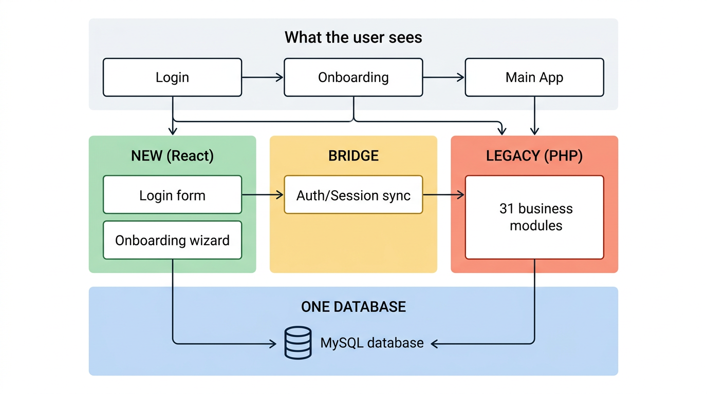
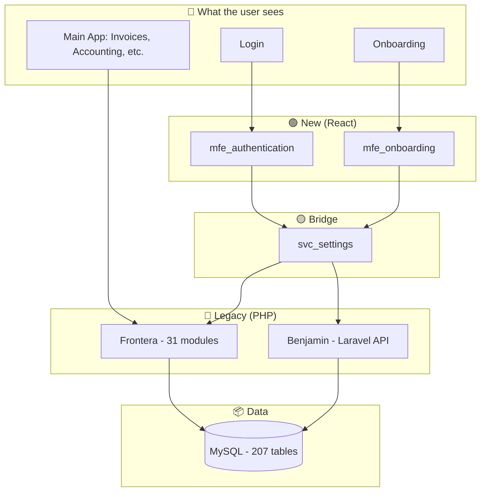

# Colppy Architecture — CEO Overview

> A non-technical view of how Colppy works today and why it feels like a mess.

---

## Visual Summary



---

## What the User Sees (Simple)

```
┌─────────────────────────────────────────────────────────────────┐
│  USER JOURNEY                                                    │
│                                                                  │
│  1. Login (email + password)                                    │
│  2. Onboarding wizard (if new — company setup)                   │
│  3. Main app: Invoices, Accounting, Treasury, Reports, etc.     │
└─────────────────────────────────────────────────────────────────┘
```

One product, one experience. The user doesn't see the complexity.

---

## What's Actually Behind It (The Reality)

```
                    ┌─────────────────────────────────────┐
                    │         WHAT THE USER SEES          │
                    │  Login · Onboarding · Main App     │
                    └─────────────────┬─────────────────┘
                                      │
        ┌─────────────────────────────┼─────────────────────────────┐
        │                             │                             │
        ▼                             ▼                             ▼
┌───────────────┐           ┌─────────────────┐           ┌───────────────────┐
│  NEW CODE     │           │  BRIDGE LAYER  │           │  OLD CODE         │
│  (React)      │           │  (NestJS)       │           │  (PHP, 14 years)   │
│               │           │                 │           │                   │
│ • Login form  │──────────▶│ • Auth bridge   │──────────▶│ • 31 business     │
│ • Onboarding  │           │ • Session sync   │           │   modules         │
│   wizard      │           │                 │           │ • Invoices        │
│               │           │                 │           │ • Accounting      │
└───────────────┘           └────────┬────────┘           │ • Treasury        │
                                    │                     │ • Everything else │
                                    │                     └────────┬─────────┘
                                    │                              │
                                    ▼                              ▼
                            ┌───────────────────────────────────────────┐
                            │         ONE DATABASE (MySQL)               │
                            │         207 tables, shared by all          │
                            └───────────────────────────────────────────┘
```

**In plain words:** We're in the middle of a migration. New screens (login, onboarding) are modern React. The rest of the app is legacy PHP. A bridge service keeps both worlds talking. Everything shares one database.

---

## Why It Feels Like a Mess

| Factor | What it means |
|--------|---------------|
| **108 repositories** | Code is split across 108 separate Git repos. Not a monorepo. Each has its own CI, deploy, and ownership. |
| **Two GitHub orgs** | `colppy/` (new services) and `nubox-spa/` (legacy core). Historical split. |
| **Three ways to reach the database** | PHP (raw), Laravel (Benjamin), NestJS (new services). Same data, different access patterns. |
| **Two auth systems** | FusionAuth (new) + legacy session table. Both active. The bridge keeps them in sync. |
| **Multiple tech leaders over time** | Each added their layer: Frontera (PHP), Benjamin (Laravel), MFEs (React), NestJS services. No full rewrite. |
| **Only 2 of 8 MFEs are live** | We have 8 micro-frontend repos. Only login and onboarding are mounted. The rest of the UI is still the old Vue/PHP app. |

---

## The Migration Journey (Where We Are)

```
     PAST                    TODAY                         FUTURE (target)
     ────                    ─────                         ───────────────

  All PHP              React (login,        More React MFEs
  One monolith         onboarding)         More NestJS
                        +                  Less PHP
  One codebase         PHP (rest)          One coherent stack
                        +
                       Laravel (Benjamin)
                        +
                       NestJS (some)
```

**We're in the middle.** The goal is to move left-to-right. We're not there yet.

---

## One-Page Visual (Mermaid)

If your tool supports Mermaid, this renders as a diagram:



---

## Key Numbers (for context)

| Metric | Value |
|--------|-------|
| Repositories | 108 |
| MySQL tables | 207 |
| Business modules (Provisiones) | 31 |
| MFEs in production | 2 (auth, onboarding) |
| MFEs built but not mounted | 6 |
| AWS Lambda functions | 20 |
| GitHub orgs | 2 (colppy, nubox-spa) |

---

## What "Clean" Would Look Like

- **One frontend stack** (e.g. React everywhere)
- **One backend pattern** (e.g. NestJS or Laravel, not both)
- **One auth system** (FusionAuth only)
- **Fewer repos** (or a monorepo)
- **Clear ownership** per domain

We're moving in that direction. The migration is incremental: we don't stop the business to rewrite. Each new feature can go to the new stack; old code stays until we migrate it.

---

*Last updated: 2026-03-06*
